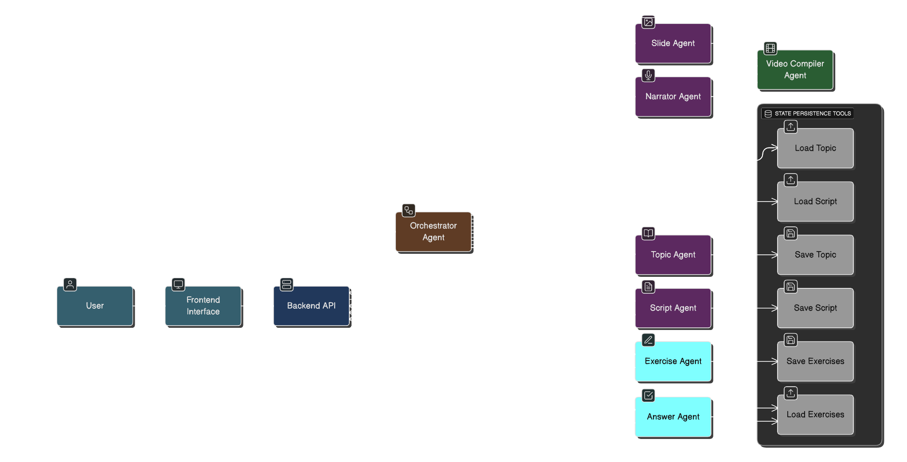
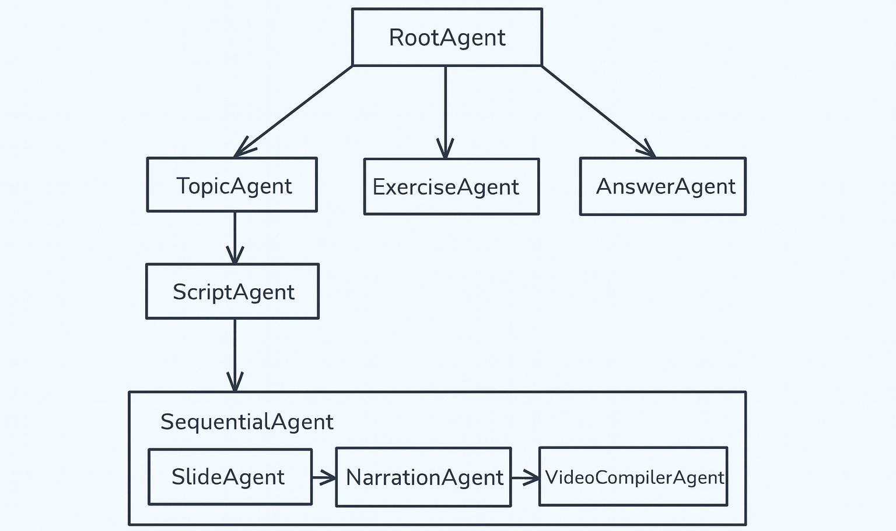

# 🎓 LearnCraft AI — Personalized AI-Generated Learning Workflow

**LearnCraft AI** transforms a simple topic description into a full learning experience: explainer video → practice exercises → answers/solutions.  
With a conversation-style interface, users can **learn, practice, and verify** — all from a single prompt.

---

## 📘 Table of Contents

- [Why LearnCraft AI?](#why-learncraft-ai)
- [Features](#features)
- [Architecture & Workflow](#architecture--workflow)
- [Application Flow](#application-flow)
- [Assumptions in the Project](#assumptions-in-the-project)
- [Tech Stack](#tech-stack)
- [Environment Configuration (Required Before Running)](#env-config)
- [Setup Instructions (Docker Compose)](#setup-instructions-docker-compose)
  - [Clone the repository](#clone-the-repository)
  - [Build and start services](#build-and-start-services)
  - [Access the services](#access-the-services)
  - [Stopping services](#stopping-services)
- [Usage Examples](#usage-examples)
- [Observability and Evaluation](#observability-and-evaluation)
- [Future Improvements](#future-improvements)

---

<a id="why-learncraft-ai"></a>
## 🎯 Why LearnCraft AI?

Many learners jump between video tutorials, PDF/HTML notes, and scattered exercises — breaking the flow and reducing retention.  

LearnCraft AI offers a **unified, agent-driven pipeline** that:  
- Converts a simple input topic (e.g. “Explain photosynthesis”) into a structured video lesson.  
- Automatically generates beginner-friendly exercises for practice.  
- Provides correct answers on demand.  

This restores a continuous, interactive learning loop: **Teach → Practice → Check → Improve** — without switching platforms.

---
<a id="features"></a>
## ✅ Features

- Generate full **video lessons** from plain-text topic descriptions  
- Auto-create **practice exercises** for the lesson content  
- Provide **answers/solutions** on demand  
- Maintain **session context**: topic, exercises, answers persist in conversation  
- Supports **multi-mode usage**: video tutor, quiz mode, solution mode  
- Modular — easy to extend with more agents or tools
- Works with natural language — no formatting required


---
<a id="architecture--workflow"></a>
## ⚙️ Architecture & Workflow

1. **User Input** — A simple text prompt like *“Explain Newton’s laws”*  
2. **Orchestrator Agent** — Determines what to call based on prompt (video / exercise / answers)  
3. **Agents Chain**:  
   - `TopicAgent` — extracts clean short topic name  
   - `ScriptAgent` — writes full lesson content script  
   - `SlideAgent` + `NarratorAgent` — generate slides and narration  
   - `VideoCompilerAgent` — stitches slides + audio into MP4 video  
   - `ExerciseAgent` — generates practice questions from the lesson  
   - `AnswerAgent` — generates matching solutions when requested
4. **State Persistence Tools** — `save_topic` / `save_exercises` / `save_script` / `load_topic` / `load_exercises` / `load_script` to keep context across messages  
5. **Frontend & Backend**:  
   - Backend: `FastAPI` + agent runner  
   - Frontend: `Streamlit` for interactive chat UI  






---
<a id="application-flow"></a>
## 🔄 Application Flow

| User Action                  | System Response              | Stored Context  |
| ---------------------------- | ---------------------------- |-----------------|
| "Explain Quantum Tunneling"  | Generates full video lesson  | `script_text`   |
| "Give me exercises"          | Generates practice questions | `exercise_text` |
| "Show answers"               | Returns matching solutions   | `answers`       |
| "Next topic: Photosynthesis" | New learning loop starts     | Context updated |

The system is session-aware — meaning it remembers what the user is learning.

---
<a id="assumptions-in-the-project"></a>
## 📌 Assumptions in the Project

- The user interacts in natural conversation style (not structured commands).

- The order is often: Video → Exercises → Answers, though the user may skip steps.

- Only one topic is active per session (currently no parallel topics).

- Exercises must exist before answers are requested.

- Video generation uses a scripted format (not real dynamic scene creation).

---
<a id="tech-stack"></a>
## 🛠️ Tech Stack

| Layer           | Technologies                                    |
| --------------- | ----------------------------------------------- |
| Agent Framework | Google Agent Developer Kit (ADK)                |
| Backend         | FastAPI                                         |
| Frontend        | Streamlit                                       |
| LLM             | Gemini 2.0 API                                  |
| Runtime         | Python 3.10+                                    |
| Persistence     | In-memory session storage (upgrade-ready to DB) |
| Build/Deploy    | Docker & Docker Compose                         |

---
<a id="env-config"></a>

## ⚙️ Environment Configuration (Required Before Running)

Create a .env file in the project root and add the following:
```bash
GOOGLE_API_KEY=your_google_api_key_here
MODEL_TEXT=gemini-2.0-flash-001
# Optional lightweight model
# MODEL_TEXT=gemini-2.0-flash-lite
MODEL_TTS=en-US-AriaNeural
```
💡 *Your Google API key is required for agent execution, tool calling, and Gemini responses.*
___

<a id="setup-instructions-docker-compose"></a>
## 🧩 Setup Instructions (Docker Compose) 

<a id="clone-the-repository"></a>
### 1️⃣ Clone the repository
```bash
git clone https://github.com/Anubrata12/learncraft-ai.git
cd learncraft-ai
```
<a id="build-and-start-services"></a>
### 2️⃣ Build and start services
```bash
docker compose up --build
```
<a id="access-the-services"></a>
### 3️⃣ Access the services
| Service     | URL                                            |
|-------------| ---------------------------------------------- |
| Frontend UI | [http://localhost:8501](http://localhost:8501) |
| Swagger API | [http://localhost:8000](http://localhost:8000) |

<a id="stopping-services"></a>
### 4️⃣ Stopping services
```bash
docker compose down
```

---
<a id="usage-examples"></a>
## 🧪 Usage Examples

- “Explain algebra with examples”

- “Give me practice questions”

- “Now give answers”

- “Teach me another chapter: Photosynthesis”
---
<a id="observability-and-evaluation"></a>
## 📊 Observability and Evaluation
#### Agent Observability
Built-in observability layer is included that captures every agent step, tool invocation, state transition, and error event. 
All interactions are logged through a pluggable logging pipeline, enabling full traceability and easier debugging of complex multi-agent workflows. Structured logs can be streamed to the console, persisted in the backend, or pushed to external dashboards for deeper analysis.

#### Agent Evaluation
Evaluation harness for validating agent correctness, performance, and reliability is included.
Scenarios are defined in JSON evalset, and the evaluation engine replays conversations, measures tool-call accuracy, and scores final outputs. This allows regression checks as we iterate on prompts, models, or agent logic.

#### Steps to run pyTEST
> pytest .\test

---
<a id="future-improvements"></a>
## 🔭 Future Improvements

- Database-backed SessionService

- Context compaction for long conversations

- Adaptive learning difficulty

- Learning paths + dashboards

- Mobile app with offline learning

- Multilingual teaching

- Persona-based tutor styles
